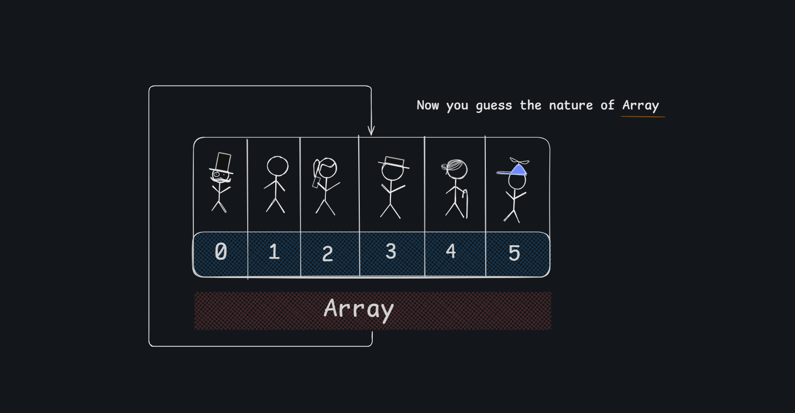
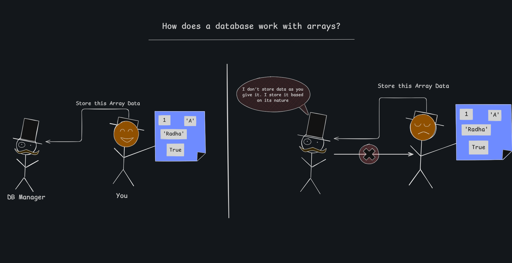
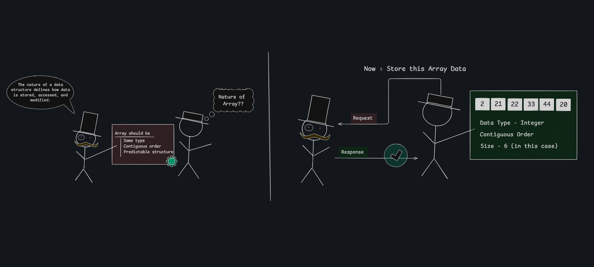
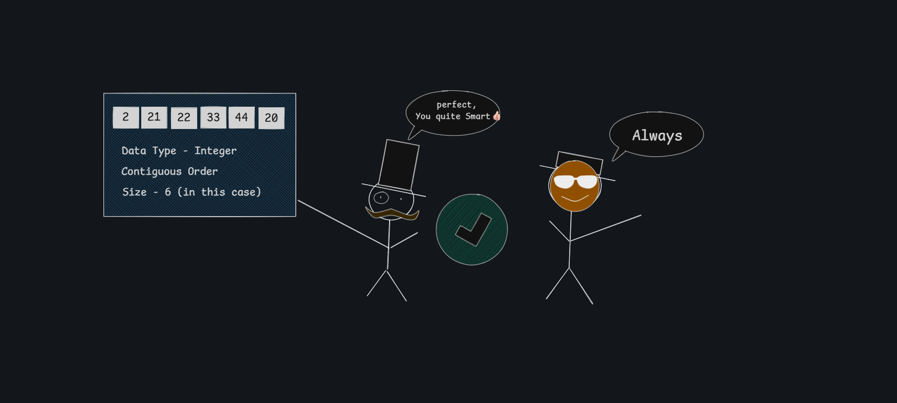

# Arrays — The Essentials

> An array is a simple way to store a list of items in one place, where each item has a fixed position, so you can easily find it using its number/index.

---





## Valid vs Invalid



A database stores data **based on its nature**, not just as-is.

```
✗  [1, 'A', 'Radha', True]   → mixed types  — rejected
```

---

## Accepted Array Properties



## The 3 Rules

| Rule | Meaning |
|------|---------|
| **Same type** | All elements must share one data type |
| **Contiguous order** | Slots sit next to each other in memory |
| **Predictable structure** | Fixed size declared upfront |

The *nature* of a data structure defines how data is stored, accessed, and modified.

---


## Confirmation



Once validated, the array is stored successfully. The structure is now predictable and fast to access.

---

## Accessing & Modifying Data


## 🔗 Reference
> Want the answer? Check out this repo: 👉 https://github.com/alakasingh/Data-Structure/tree/main/Linear-DS/Array/CRUD-Operation


