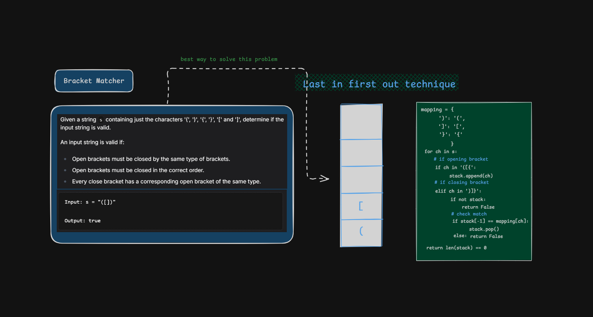
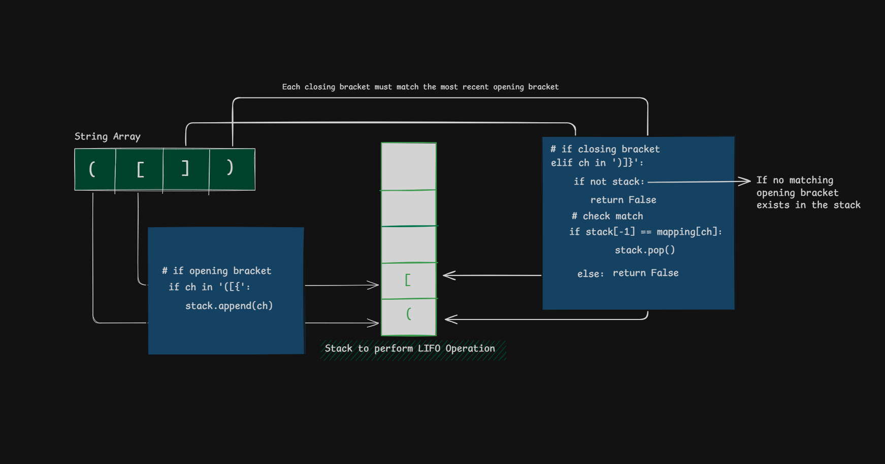
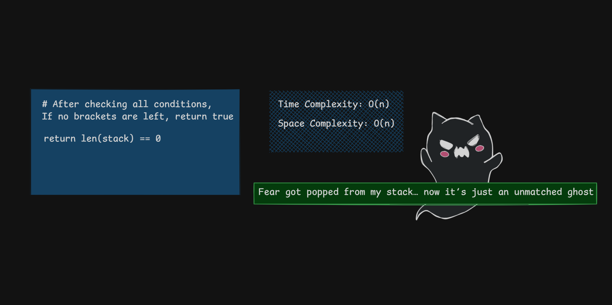

# 🧩 Bracket Matcher (Stack-Based Validation)

  

  🚀 Validating parentheses using Stack (LIFO)  
  ⚡ Clean | Visual | Interview-Ready

-orange)

## 🎥 Visual Walkthrough

### Step 1: Push Opening Brackets & Match Closing Brackets

  

### Step 3: Final Validation

  

## 🧪 Dry Run Example

Input: `([])`

| Step | Character | Stack | Action |
|------|----------|------|--------|
| 1    | (        | (    | Push   |
| 2    | [        | ([   | Push   |
| 3    | ]        | (    | Pop    |
| 4    | )        |      | Pop    |

✅ Stack is empty → Valid

## ❌ Common Mistakes

- Not checking empty stack before popping
- Ignoring mismatched types like `(]`
- Not validating leftover elements in stack

## 🌍 Real-World Applications

- Compiler syntax checking
- Expression evaluation
- Code editors (auto bracket matching)

## 📊 Complexity Explained

- We traverse the string once → O(n)
- Stack operations (push/pop) are O(1)
- In worst case, all elements go into stack → O(n) space
